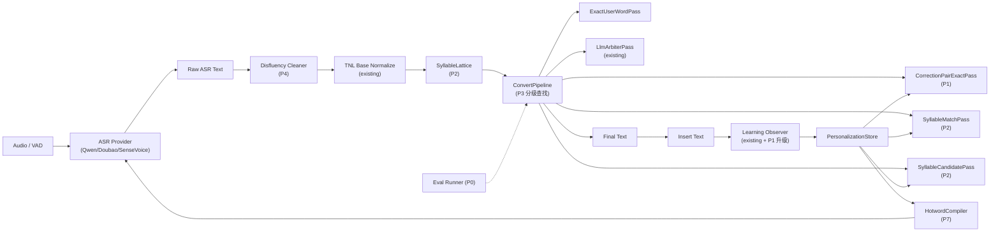

# ASR 个性化识别质变方案 v3（MVP-first 执行版）

> 本方案基于对豆包输入法 v0.8.1 离线 ASR 流水线的逆向分析（见 `/Users/yzl/Documents/project/reverse_doubao/`）和当前项目的现状评估，给出一份 9 阶段、可执行的演进路线。
>
> v1 方案的问题：把"豆包效果好"归因为后处理规则更精细，导致整个方案是"规则替换器的升级版"。v2 方案修正这个认知：豆包的核心在于 ASR 输出之后还有一层**本地 IME 引擎做二次解码**（AsrWordConversion + SyllableLattice），相当于把 ASR 文本当作"拼音"重新转换一遍。这层逻辑用 Rust 本地实现完全可行，是真正的质变所在。
>
> v3 方案在 v2 基础上收紧工程落地：先做一条可验证的本地二次解码闭环，再扩展到完整 IME 化。重点补充 MVP 切片、误伤硬门槛、跨语言 alias key、存储迁移路径，以及与当前 `TnlEngine`/`FuzzyMatcher` 现状兼容的渐进式改造方式。

---

## 零、v3 修订原则（先证明闭环，再扩展系统）

### 不是两次 ASR

本方案不引入"先本地 ASR、再云端 ASR"或"两次云端 ASR"。目标链路是：

```text
Audio
  -> ASR Provider 一次
  -> Raw ASR Text
  -> 本地个性化二次解码（音化 key / alias key / correction pair）
  -> 可选 LLM 候选仲裁或全文润色
  -> Final Text
```

本地二次解码处理的是 ASR 已经输出的文本，不重新识别音频。后续 HotwordCompiler 只是在下一次录音前给 ASR provider 注入更好的热词提示，也不是第二次 ASR。

### 第一条垂直闭环（3-5 天）

先用最小闭环证明核心假设：

```text
20 条 mini eval 样本
+ cloud code 错形族
+ correction pair 持久化
+ phonetic / alias key 命中
+ 本地直接替换
+ 诊断日志
+ 一键 eval
```

MVP 必须覆盖：

- `cloud code -> Claude Code` 字面命中
- `claud code -> Claude Code` 英文音近命中
- `cloud coat -> Claude Code` 英文音近命中
- `克劳德 code -> Claude Code` 跨语言 alias 命中
- `I use cloud storage` 不误替换

### 硬门槛

| 指标 | MVP 门槛 | 说明 |
|---|---:|---|
| 已学习重复错误修正率 | >= 70% | 只统计库中已有 pair 的样本 |
| false_replacement_rate | <= 1% | 优先保守，宁可漏修也不能乱修 |
| p95 本地处理耗时 | <= 30ms | 不含 ASR、LLM |
| LLM 仲裁触发率 | <= 15% | 本地高置信路径应该截胡多数重复错误 |
| 诊断 payload | bounded | 不持久化完整 prompt、密钥、长文本 |

### 三个关键收紧

1. **CorrectionPair key 不是只靠自动计算**：必须支持一条 pair 保存多个 `alias_keys`，用于 `克劳德 code` 这类跨语言音译入口。
2. **存储先旁路验证，再引入 SQLite**：当前项目个人词典仍是 `AppConfig.dictionary: Vec<String>`；`pinyin`/`rphonetic` 已在依赖里，但 `rusqlite` 尚未引入。第一版可以用配置旁路 JSON 验证收益，确认后再迁到 SQLite。
3. **ConvertPipeline 先包装现有 TNL，再逐步拆分**：当前 `TnlEngine` 已有拼音、Double Metaphone、候选诊断和 LLM 仲裁基础。P3 不做一次性推倒重写，先把现有能力包装成 Pass，再抽出新 Pass。

---

## 一、问题与核心判断

### 用户感知的问题

- `Claude Code` 反复被识别为 `cloud code`，修过仍然错
- 中英混合技术短语被断开、音译或局部中文化
- 同一族错形（`cloud code / claud code / cloud coat / 克劳德 code`）需要逐个修一遍

### 豆包能修对的真正原因

不是云端 ASR 修对的（云端 ASR 大概率也输出 `cloud code`），而是本地有一套完整的"输入法引擎"：

```
ASR 输出（云端/本地）
  → AsrWordConversion（重新音化）
  → SyllableLattice（音节格匹配，902 处字符串引用）
  → 15 个 ConvertBy 阶段（多层独立词典查询）
  → AsrUserCorrectDict（音化纠错对：original, modify, userInput, frequency）
  → 最终文本
```

关键观察：豆包的 `AsrUserCorrectDict::Add` 签名是**4 参数三元组**，其中 `userInput` 字段存的是拼音/音素串。这意味着一条纠错对能覆盖一整族同音错形，而不是仅命中字面字符串。

### 当前项目的真正差距

不是"后处理规则不够多"，而是缺少"把 ASR 输出反音化、用音节格做候选生成"这一整层结构。当前 TNL 已经有 `tech_span / fuzzy / hyphen rewrite`、拼音、Double Metaphone 和中置信候选仲裁雏形，但它仍然主要围绕**现有词典条目**做即时规则替换，缺少持久化的 `original -> corrected -> phonetic/alias key` 纠错对，也缺少能覆盖跨语言音译错形族的 window/alias 候选生成。

---

## 二、边界条件（明确不做的部分）

| 项 | 状态 | 理由 |
|---|---|---|
| 拿到 ASR provider 的 `phonemes / words / confidence` 字段 | **不做** | 公开 API 不返回，豆包私有协议需 mTLS 证书 |
| 在线 + 本地 ASR 双路 ensemble | **不做** | 本期不引入本地 ASR 模型，单 ASR 链路即可 |
| 本地 ASR 模型（Whisper / Sherpa-ONNX 等） | **不做** | 体积、性能、维护成本与收益不匹配 |
| 多 provider ensemble 重排 | **不做** | 维持现有 race_strategy 的 fallback 行为 |
| 复刻豆包私有 ASR 协议 | **不做** | mTLS 客户端证书白名单封死，且法律风险 |

**唯一会做的"前置 ASR 抽象"**：现有 race_strategy 已经把多个云端 ASR provider 抽象掉了，新方案直接消费它的文本输出，**不再为 AsrWordConversion 单独抽 ASR 层**。

---

## 三、目标架构



---

## 四、Phase 0｜评测集与诊断落盘（基础）

### 为什么先做

没有评测集，后面每一步都是盲调，做完不知道好没好、退化没退化。所有后续 Phase 的验收都依赖这套基线。

### 任务

1. **Phase 0A mini eval**：先收 15-30 条真实错误样本，跑通 case schema、runner、报告输出和诊断字段
2. **Phase 0B 完整评测集**：从日常使用中扩展到 80-120 条真实错误样本
3. **分桶**：
   - 技术词（30%，如 `Claude Code / Cursor / Windsurf / TypeScript`）
   - 中英混合（25%，如 `调用 LLM 接口 / 部署到 Kubernetes`）
   - 人名/产品名（20%）
   - 长句（15%，> 30 字）
   - 短句（10%，< 8 字）
4. **每条记录的 schema**：
   ```json
   {
     "audio_id": "20260514-001",
     "audio_wav_path": "...",
     "provider": "qwen-realtime",
     "raw_asr_text": "我在用 cloud code 写代码",
     "expected_text": "我在用 Claude Code 写代码",
     "user_final_text": "我在用 Claude Code 写代码",
     "category": "tech_mix",
     "notes": "...",
     "diagnostics": { /* 各 Pass 输出，运行时填充 */ }
   }
   ```
5. **诊断落盘**：每次实际识别都落盘到 `%APPDATA%\PushToTalk\diagnostics\YYYY-MM-DD\` JSON，每个 Pass 的输入/输出/命中/耗时；payload 必须脱敏并限制长度；个性化运行时文件使用 `personalization-<timestamp>-<uuid>.json`，并按天最多保留 200 个个性化诊断文件
6. **eval runner**：`cargo run --bin eval_asr -- --suite tests/asr_eval/` 一键跑全集
7. **调参 sweep**：`cargo run --bin eval_asr -- --sweep-thresholds 0.70,0.88,0.99 --sweep-window-tokens 3,5 --allow-quality-gate-failure` 一次输出阈值/窗口对比表

### 指标

```
final_accuracy            最终文本完全匹配率
correction_pair_hit_rate  纠错对命中率
syllable_match_hit_rate   音节格命中率
false_replacement_rate    误替换率（必须监控防退化）
llm_arbiter_trigger_rate  LLM 仲裁触发率
llm_arbiter_accept_rate   LLM 仲裁接受率
avg_latency_ms            平均处理时延（不含 ASR / LLM）
p95_latency_ms            p95 本地处理时延（不含 ASR / LLM）
```

### 产出物

- `tests/asr_eval/cases/*.json` 评测样本
- `src-tauri/src/bin/eval_asr.rs` 运行器
- `tests/asr_eval/baseline_report.md` 基线报告（v1 状态下的成绩，作为后续对比基准）
- sweep 报告：用于比较 `apply_threshold` 与 `max_window_tokens` 对命中率、误伤率、below-threshold 候选和 p95 延迟的影响

### 工程量

3 天（mini eval + 工具 1 天，采样扩展 2 天）

### 退出条件

- mini eval 可以在本地稳定运行，失败样本会输出明确 diff
- baseline report 能展示当前 TNL 的命中、漏修、误伤
- 诊断 JSON 不包含密钥、完整 LLM prompt 或无界长文本

---

## 五、Phase 1｜CorrectionPairStore（带音化 key + alias key）

### 为什么是 P1

这是真正能让 "修过一次就稳定修对" 的核心机制。豆包 `AsrUserCorrectDict::Add(original, modify, userInput, frequency)` 那个第三个参数 `userInput`（拼音/音素串）就是关键 —— 让同一族同音错形通过同一条纠错对命中。

### 任务

1. **新建模块** `src-tauri/src/personalization/correction_pair_store.rs`
2. **存储落地顺序**：
   - MVP：先用 `%APPDATA%\PushToTalk\personalization\correction_pairs.json` 旁路存储，降低数据库迁移风险；写入必须走同目录 `.tmp` + `.bak` 原子替换
   - 同一 `original_text` 被用户再次接受为不同 `corrected_text` 时，必须刷新 pair id 与派生 key，并清理旧目标生成的跨语言 alias，避免旧 alias 指向新目标
   - 稳定后：引入 SQLite，把 `correction_pairs`、用户词分类、诊断索引统一治理
   - 迁移原则：现有 `AppConfig.dictionary: Vec<String>` 暂不删除，先让 TNL/ASR 继续消费现有词典，CorrectionPairStore 作为新增个性化层
3. **SQLite schema（稳定后迁移目标）**：
   ```sql
   CREATE TABLE correction_pairs (
       id TEXT PRIMARY KEY,
       original_text TEXT NOT NULL,
       corrected_text TEXT NOT NULL,
       -- 音化 keys
       en_phonetic_key TEXT,         -- Double Metaphone, e.g. "cloud code" -> "KLTKT"
       zh_pinyin_key TEXT,           -- 无声调拼音, e.g. "克劳德" -> "kelaode"
       zh_pinyin_fuzzy_key TEXT,     -- 模糊音规整: zh→z, ch→c, sh→s, n→l, an→ang
       mixed_key TEXT,               -- 中英混合归一化 key
       alias_keys_json TEXT,          -- 跨语言/人工确认入口，如 ["kelaode|KT", "claude|code"]
       length_chars INTEGER NOT NULL,
       -- 元数据
       source TEXT NOT NULL,         -- learned / manual / imported
       app_context TEXT,
       surrounding_context TEXT,
       category TEXT,                -- product / person / phrase / generic
       frequency INTEGER NOT NULL DEFAULT 1,
       confidence REAL NOT NULL DEFAULT 0.5,
       accepted_count INTEGER NOT NULL DEFAULT 0,
       rejected_count INTEGER NOT NULL DEFAULT 0,
       last_seen_at INTEGER,
       enabled INTEGER NOT NULL DEFAULT 1,
       created_at INTEGER NOT NULL,
       updated_at INTEGER NOT NULL
   );

   CREATE INDEX idx_pair_en ON correction_pairs(en_phonetic_key);
   CREATE INDEX idx_pair_zh ON correction_pairs(zh_pinyin_fuzzy_key);
   CREATE INDEX idx_pair_mixed ON correction_pairs(mixed_key);
   CREATE INDEX idx_pair_original ON correction_pairs(original_text);
   ```
4. **Rust crate 选型**：
   - 旁路 JSON：复用现有 `serde` / `serde_json`
   - SQLite：后续新增 `rusqlite`（当前尚未在 `Cargo.toml` 中引入）
   - 中文拼音：已引入 `pinyin` crate（无声调 key 使用 `plain()`）
   - 英文 Metaphone：已引入 `rphonetic` crate（含 Double Metaphone）
   - 模糊音规整：自实现 `to_fuzzy_pinyin()` 20 行
5. **校验规则**（豆包文档明确给出）：
   - `original_text != corrected_text`
   - 中文纯字 pair 才要求 `original.chars().count() == corrected.chars().count()`；中英混合和英文短语不强制等长
   - `fuzzy_class` 必须兼容
   - 英文常见词（前 1000 高频）需要 `manual` 来源才允许 pair
   - alias key 只能来自用户接受、手动确认或高置信 LLM 判断，不能对所有混合文本自动扩散
6. **学习接入**：现有 [learning/coordinator.rs](src-tauri/src/learning/coordinator.rs) + [learning/diff_analyzer.rs](src-tauri/src/learning/diff_analyzer.rs) 增加产出 `CorrectionPairSuggestion`，与现有 `LearningSuggestion` 并行
7. **置信度更新规则**：
   ```
   用户接受 +0.1
   再次观察到同样修正 +0.05
   手动确认 +0.3
   LLM 仲裁接受 +0.05
   用户撤销 -0.2
   用户改回原文 -0.3
   LLM 仲裁拒绝 -0.05
   ```

### 防误伤

- 不替换常见短词（< 3 字符），除非 pair 是 `manual` 来源
- 不跨句替换
- 不替换已经精确命中用户词的片段
- 中文单字 pair 默认禁用自动应用
- 用户撤销或改回原文后必须降权；连续负反馈后自动禁用该 pair
- `cloud` 这类常见词只允许在窗口级 key（如 `cloud code`）上自动应用，不允许单词级泛化到任意上下文

### 查询接口（Phase 2 会用）

```rust
pub struct CorrectionPairStore {
    backend: CorrectionPairBackend, // MVP: JSON file；稳定后: SQLite
}

impl CorrectionPairStore {
    pub fn lookup_by_text(&self, original: &str) -> Vec<CorrectionPair>;
    pub fn lookup_by_en_phonetic(&self, key: &str) -> Vec<CorrectionPair>;
    pub fn lookup_by_zh_pinyin_fuzzy(&self, key: &str) -> Vec<CorrectionPair>;
    pub fn lookup_by_mixed(&self, key: &str) -> Vec<CorrectionPair>;
    pub fn lookup_by_alias_key(&self, key: &str) -> Vec<CorrectionPair>;
    pub fn add(&mut self, pair: CorrectionPair) -> Result<()>;
    pub fn record_accept(&mut self, id: &str) -> Result<()>;
    pub fn record_reject(&mut self, id: &str) -> Result<()>;
}
```

### 工程量

1 周

### 验收

- 评测集中"重复错误"类样本（在学习库里已存在对应 pair 的样本）的修正率 >= 70%
- `cloud code / claud code / cloud coat / 克劳德 code` 至少前三类可命中；`克劳德 code` 若未在 P1 命中，必须在 P2 alias/window 路径命中
- false replacement rate <= 1%
- 用户拒绝/撤销能写入负反馈，并影响下一次匹配

---

## 六、Phase 2｜本地 SyllableLattice / 音节格候选生成

### 为什么是 P2

让单条 correction_pair 覆盖一整族错形。否则每族错形都要单独学一遍。这一层是豆包 AsrWordConversion 的本地等价实现。

P2 的第一版不追求完整复刻豆包内部 lattice，而是实现**token window + phonetic/alias key 候选生成**。只有当 MVP 指标证明收益后，再扩展更多 IME 风格能力。

### 任务

1. **新建模块** `src-tauri/src/tnl/syllable_lattice.rs`
2. **数据结构**：
   ```rust
   pub enum Lang { Cn, En, Mixed, Other }

   pub struct PhoneticToken {
       pub text: String,
       pub byte_range: Range<usize>,
       pub lang: Lang,
       pub pinyin_variants: Vec<String>,         // 中文每字的拼音候选（含模糊音）
       pub metaphone: Option<(String, Option<String>)>, // 英文 primary + alternate
   }

   pub struct SyllableLattice {
       pub source_text: String,
       pub tokens: Vec<PhoneticToken>,
   }

   pub struct WindowKey {
       pub token_range: Range<usize>,
       pub byte_range: Range<usize>,
       pub text: String,
       pub en_phonetic_key: Option<String>,
       pub zh_pinyin_fuzzy_key: Option<String>,
       pub mixed_key: Option<String>,
       pub alias_keys: Vec<String>,
       pub length_chars: usize,
   }
   ```
3. **核心方法**：
   ```rust
   impl SyllableLattice {
       pub fn from_asr_text(text: &str) -> Self;

       /// 滑动窗口生成所有 1..=max_size token 的窗口 key
       pub fn windows(&self, max_size: usize) -> Vec<WindowKey>;
   }
   ```
4. **关键实现细节**：
   - 分词：复用 [tnl/tokenizer.rs](src-tauri/src/tnl/tokenizer.rs)
   - 中文每字的拼音候选（破=`pò`/`pò`，多音字全部展开）
   - 英文 Metaphone 拿 primary + alternate 两个 key
   - 中英交界处单独切（"克劳德 code" 切成 `[克劳德][ ][code]`）
   - 生成跨语言 alias key：例如 `克劳德 code` 可以生成 `kelaode|KT`、`kelaode|code`，用于命中用户确认过的 `Claude Code`
   - 跳过纯空白和纯符号 token
   - 模糊音规整：zh↔z, ch↔c, sh↔s, n↔l, an↔ang, en↔eng, in↔ing
5. **新增 Pass**：`SyllableMatchPass` 在 ConvertPipeline 里（Phase 3 一起实现）
   ```rust
   pub struct SyllableMatchPass {
       store: Arc<CorrectionPairStore>,
       confidence_threshold: f32,  // 高于此值直接替换，低于进入候选池
   }
   ```
6. **窗口大小**：默认 `max_size = 5`，覆盖 `cloud code`（2 token）、`use claude code`（3 token）、`switch to claude code now`（5 token）等
7. **歧义处理**：
   - 一个窗口可能匹配多条 pair（按 frequency × confidence 排序）
   - 多个窗口可能重叠（按窗口长度优先 + 置信度排序，长窗口优先吃掉短窗口）
   - alias key 命中的候选初始置信度低于字面/英文音近命中，除非来源是 `manual`
   - 若窗口包含常见词且上下文弱，优先进入候选池，不直接替换

### 工程量

1.5 周

### 验收

设计一组"错形族"样本（每条 pair 至少配 4 种错形，如 `cloud code / claud code / cloud coat / 克劳德 code`），学习一次后所有错形都被命中。

### 退出条件

- 每条 pair 至少覆盖 3 种错形，`Claude Code` 类样本覆盖 4 种错形
- 重叠窗口选择可诊断：日志能解释为什么选择长窗口、为什么跳过短窗口
- 关闭 `SyllableMatchPass` 后结果可回退到 P1/P0 行为
- 单条文本窗口数量有上限，避免长句指数级膨胀

---

## 七、Phase 3｜ConvertPipeline 分级查找重构

### 为什么是 P3

v1 方案的 `PersonalizedRanker` 是一个综合打分函数（多个权重相加）。问题：每个权重互相影响、调参困难、bug 难定位。改成 IME 风格的分级查找后，每一级独立可调、可关、可日志。

落地策略必须渐进：先把现有 `TnlEngine` 的基础规范化、拼音匹配、英文音近匹配、诊断候选包装成 Pass，再新增 CorrectionPair/Syllable Pass。不要一次性重写 `normal.rs`、`assistant.rs` 和 `TnlEngine`，避免破坏当前已验证的 TNL 合约。

### 任务

1. **第一步：包装现有能力**
   - `BaseNormalizePass`：封装现有 Unicode normalize、口语符号、字母合并、连字符 rewrite
   - `ExistingDictionaryPass`：封装现有 `FuzzyMatcher` 的拼音/英文音近逻辑
   - `ExistingCandidateDiagnosticsPass`：保留当前中置信候选进入 LLM 仲裁的能力
2. **第二步：新建** `src-tauri/src/tnl/convert_pipeline.rs`
3. **trait 定义**：
   ```rust
   pub struct ConvertContext {
       pub source_text: String,
       pub lattice: SyllableLattice,
       pub app_context: Option<String>,
       pub recent_history: Vec<String>,
   }

   pub struct ConvertResult {
       pub replacements: Vec<Replacement>,
       pub candidate_pool: Vec<Candidate>,   // 中置信候选，留给后续 Pass 或 LLM
       pub diagnostics: PassDiagnostics,
   }

   pub trait ConvertPass: Send + Sync {
       fn name(&self) -> &'static str;
       fn enabled(&self, config: &TnlConfig) -> bool;
       fn apply(&self, ctx: &mut ConvertContext, current_text: &str) -> ConvertResult;
   }
   ```
4. **Pass 顺序**（高置信命中可停止，候选类继续向后传递）：
   ```
   1. BaseNormalizePass         现有基础规范化 → 直接应用
   2. ExactUserWordPass         手动用户词字面命中 → 保护/直接替换
   3. CorrectionPairExactPass   纠错对字面命中 → 直接替换
   4. SyllableMatchPass         音节格/alias 匹配 + 高置信 pair → 直接替换
   5. SyllableCandidatePass     音节格/alias 匹配 + 中置信 → 进候选池
   6. LlmArbiterPass            候选池非空时调用 LLM 仲裁
   ```
5. **每个 Pass 独立**：
   - 独立计时
   - 独立命中/未命中计数（落盘到 diagnostics）
   - 独立 disable 开关（config 字段）
6. **重构现有 [pipeline/normal.rs](src-tauri/src/pipeline/normal.rs)**：
   - 第一阶段保持 `TnlEngine::normalize()` 对外 API 不变，内部委托 ConvertPipeline
   - 第二阶段再让 `NormalPipeline`/`AssistantPipeline` 显式调用 ConvertPipeline
   - LLM 仲裁先复用现有 `LlmPostProcessor::arbitrate_tnl_candidates`，稳定后再封装为 `LlmArbiterPass`
7. **决策阈值**（保留 v1 方案里的阈值，但语义更清晰）：
   ```
   confidence >= 0.88  -> 直接替换
   0.68 <= c < 0.88    -> 进候选池，由 LlmArbiterPass 处理
   0.55 <= c < 0.68    -> 仅记录诊断
   c < 0.55            -> 丢弃
   ```

### 工程量

5 天

### 验收

- 每个 Pass 的命中率/误伤率可独立观测
- 单独关闭任一 Pass 不会让整个 pipeline 崩
- 评测集总命中率比 Phase 2 末再提 5-10 个百分点
- LLM 仲裁触发率下降（因为更多高置信替换在 SyllableMatchPass 截胡）
- 现有 TNL 回归测试保持通过，尤其是"精确词库命中优先于音近纠错"合约

---

## 八、Phase 4｜言语流畅化规则层

### 为什么这个时机

成本极低、感知改善大、不依赖前面的复杂结构。可以与 Phase 3 并行做。

### 任务

1. **新建** `src-tauri/src/tnl/disfluency.rs`
2. **三档模式**：
   ```rust
   pub enum DisfluencyMode {
       Off,            // 完全不动
       Conservative,   // 仅去明确的句首/独立填充词（默认）
       Aggressive,     // 连重复字、长 "嗯" 都处理
   }
   ```
3. **规则清单**：
   - **填充字**：`嗯 / 啊 / 呃 / 唉 / 哎 / 诶`（句首或独立位置）
   - **填充短语**：`这个 / 那个 / 就是说 / 怎么说呢`（句首或语气位置）
   - **重复字**：`我我我` → `我`（仅 Aggressive）
   - **拖长音**：`嗯嗯嗯` → 删除（仅 Aggressive）
   - **false start**：句首未完成片段（如 `我，那个，今天...` → `今天...`）（仅 Aggressive）
4. **接入位置**：放在 TNL 之前，作为最早期清洗
5. **配置开关**：默认 Conservative，UI 提供三档切换

### 防误伤

- "这个东西很重要" 里的"这个"不能去（前后非语气位置）
- "嗯，我准备好了" 句首"嗯"可去
- "嗯哼" 整体不动（多字感叹）
- 评测集专门加边界样本

### 工程量

3 天

### 验收

- 评测集中口语化样本的"整洁度"主观打分上升
- 误删率 < 1%

---

## 九、Phase 5｜用户词分类分表

### 为什么这个时机

Phase 1 已经建立了 correction pair 存储（MVP JSON 或稳定后的 SQLite），Phase 5 是把现有个人词典也按豆包 7 类文件的思路扩展，让不同类型的词走不同 lookup 路径。

如果 P1 仍处于 JSON 旁路阶段，Phase 5 先扩展现有词典 entry metadata，不强行要求数据库已完成。等 SQLite 落地后再把 metadata 迁入 `user_terms` 表。

### 任务

1. **扩展 user_terms 表（或 JSON metadata，取决于 P1 存储形态）**：
   ```sql
   ALTER TABLE user_terms ADD COLUMN category TEXT;
   -- person | product | tool | phrase | email | url | code_symbol | domain_term | generic

   ALTER TABLE user_terms ADD COLUMN en_phonetic_key TEXT;
   ALTER TABLE user_terms ADD COLUMN zh_pinyin_fuzzy_key TEXT;

   CREATE INDEX idx_user_term_category ON user_terms(category);
   CREATE INDEX idx_user_term_en ON user_terms(en_phonetic_key);
   CREATE INDEX idx_user_term_zh ON user_terms(zh_pinyin_fuzzy_key);
   ```
2. **不同 category 走不同路径**：
   - `phrase`（≥2 token 短语）：建独立 phrase trie，在 SyllableMatchPass 之前优先匹配
   - `email / url`：用正则识别和保护，不进入音化流程
   - `code_symbol`（如 `useState / async/await / k8s`）：保留原大小写、不音化、精确匹配
   - `person / product / tool / domain_term`：进入音节格候选
   - `generic`：兜底
3. **category 推断策略**：
   - 含 `@` 且有点号 → `email`
   - 含 `://` 或以 `www.` 开头 → `url`
   - 全 ASCII 且驼峰/含下划线/含连字符 → `code_symbol`
   - 含中文且 ≥ 2 字 + 无空格 → `phrase`
   - 用 LLM 一次性批量判断（学习时调用，结果存表，不在 hot path 调用）
4. **用户 UI**：
   - DictionaryPage 增加 category 列展示
   - 允许手动改 category
   - 默认推断 + 人工微调

### 工程量

4 天

### 验收

- 邮箱/URL/代码符号不被音化误伤
- `useState` 这种保持原大小写，不被识别成 `use State`

---

## 十、Phase 6｜中文分词 + 简单 NER（视效果决定）

### 为什么排这里

成本中、收益中。前面五步是"减少错"，这一步是"识别专名应该保护"。如果 Phase 1-5 已经达到日常可用，这一步可以延后。

### 任务

1. **引入 `jieba-rs`**
2. **注入用户词典**：把现有 dictionary metadata 或 `user_terms` 里的所有词作为 jieba 用户字典，提升分词准确性
3. **词性标签利用**：
   - `nr` 人名
   - `ns` 地名
   - `nt` 机构名
   - `nz` 其他专名
4. **升级 [tnl/tech_span.rs](src-tauri/src/tnl/tech_span.rs)**：
   - 现有 `TechSpanDetector` 是规则驱动的（ASCII 连续段、连字符、版本号等）
   - 增加 NER 驱动：分词后标出 `nr/ns/nt/nz` 段，标识为"专名片段"
   - 专名片段在 SyllableMatchPass 中权重提高、误伤惩罚降低
5. **不上 ONNX NER 模型**：jieba + 用户词 + 启发式覆盖 80% 场景即可

### 工程量

1 周

### 验收

- 人名/产品名错形的修正率比 Phase 5 末再提 3-5 个百分点
- 专名内部不被误切分

### 注意

如果 Phase 1-5 跑完已经够好（最终命中率 > 85%），这步可以延后或跳过。

---

## 十一、Phase 7｜HotwordCompiler 升级

### 为什么这么靠后

豆包能修对 `cloud code → Claude Code` **主要不靠云端 ASR 修对**，靠的是本地 IME 引擎。所以等 Phase 1-3 的"本地 IME 等价物"建好之后，再优化云端热词输入，边际收益才显著。在那之前优先做云端热词是错配。

### 任务

1. **新建** `src-tauri/src/personalization/hotword_compiler.rs`
2. **三份 pack**：
   ```rust
   pub struct AsrHotwordPack {
       pub words: Vec<AsrHotword>,
       pub max_count: usize,  // provider-specific 上限
   }

   pub struct AsrHotword {
       pub text: String,
       pub weight: Option<i32>,
       pub source: HotwordSource,
       pub aliases: Vec<String>,
   }

   pub struct TnlDictionaryPack {
       pub words: Vec<String>,
       pub correction_pairs: Vec<CorrectionPair>,
   }

   pub struct LlmContextPack {
       pub lines: Vec<String>,
       pub correction_hints: Vec<CorrectionHint>,
   }
   ```
3. **编译依据（按权重排）**：
   ```
   1. 手动用户词（最高）
   2. correction_pairs.corrected_text（次高）
   3. 最近 24h 用过的词
   4. 当前 App context 相关词
   5. 当前活跃领域词
   6. 内置词库（最低，且数量受限）
   ```
4. **数量上限**：
   - Qwen Realtime：~50 词
   - Doubao Realtime：~100 词
   - 超出时按权重截断
5. **Provider-specific 格式编译**：
   - Qwen Realtime：`input_audio_transcription.corpus.text`（拼接字符串）
   - Qwen HTTP：system content（拼接段落）
   - Doubao Realtime：`corpus.context.hotwords`（带权重 JSON 数组）
   - Doubao HTTP：`additions` 数组
6. **接入点**：替换 [asr/](src-tauri/src/asr/) 里每个 provider 自己拼词库的逻辑，统一从 HotwordCompiler 拿
7. **触发时机**：每次录音开始前编译一次（缓存策略：词库未变 + App context 未变 时复用上次结果）

### 工程量

1.5 周

### 验收

- 评测集"首次识别命中率"（即原始 ASR 输出直接正确率）有小幅提升（3-5 个百分点）
- 上行热词数量稳定在 provider 上限内
- 热词列表对用户当前场景敏感（切换 App / 切换领域时词库变化）

---

## 十二、Phase 8（可选）｜本地小型 reranker

### 为什么是最末

前面做完已经达到 80% 豆包水平，这是追最后 20%。只在 Phase 0-7 全部做完且评测集仍有明显残留问题时才上。

### 候选方案

1. **轻量 ONNX reranker**：评估 `bge-reranker-v2-m3-small` 量化版（≤100MB）
2. **本地小型 LLM**：评估 `Qwen2.5-1.5B` ONNX 量化（~1GB），做一句话仲裁替代云端 LLM
3. **本地 KenLM**：从用户历史训练 ARPA n-gram，给候选打 LM 分

### 任务（如果决定做）

- 评估三种方案的体积/速度/效果
- 跑评测集对比 Phase 7 末成绩
- 选最优方案集成到 ConvertPipeline 作为 `LocalRerankerPass`
- 默认关闭，用户手动开启

### 工程量

评估 1 周 + 实现 2 周

### 判断标准

只在前面所有阶段做完后再决定。如果残留问题主要是"低频长尾词"，这步价值大；如果主要是"上下文歧义"，这步效果有限。

---

## 十三、优先级汇总表

| Phase | 名称 | 工程量 | 解决的问题 | 必做 | 可与其他并行 |
|---|---|---|---|---|---|
| 0A | mini eval + 诊断字段 | 1 天 | 先证明工具链能跑 | 必做 | - |
| 0B | 完整评测集 + 诊断落盘 | 2 天 | 没基线无法改 | 必做 | - |
| 1 | CorrectionPairStore（音化 key + alias key） | 1 周 | "修过一次还修不对" | 必做 | - |
| 2 | Syllable/window candidate | 1.5 周 | 一族错形要单独修 | 必做 | - |
| 3 | ConvertPipeline 分级查找（包装优先） | 5 天 | 决策黑盒、不可调 | 必做 | Phase 4 |
| 4 | 言语流畅化 | 3 天 | 文本不够整洁 | 强烈建议 | Phase 3 |
| 5 | 用户词分类分表 | 4 天 | 邮箱/代码被误伤 | 建议 | - |
| 6 | jieba + NER | 1 周 | 专名识别 | 视效果 | - |
| 7 | HotwordCompiler 升级 | 1.5 周 | ASR 上游 bias 精细化 | 视效果 | - |
| 8 | 本地 reranker | 3 周 | 长尾质量追平 | 可选 | - |

**总计**：必做部分约 4 周（Phase 0-3），加强烈建议项约 4.5 周（含 Phase 4），全做完约 11 周。

**开工切片**：第一周不要追完整 80-120 条评测集，也不要直接引入 SQLite。先完成 `mini eval + correction pair JSON store + Claude Code 错形族 + 诊断报告`，作为进入 P1 完整实现的门槛。

### 前四周重排

| 周期 | 目标 | 必须产出 |
|---|---|---|
| Week 1 | mini eval + Claude Code 垂直闭环 | `eval_asr`、20 条样本、JSON correction pair、错形族通过、baseline report |
| Week 2 | CorrectionPairStore 完整化 | 学习接入、负反馈、alias key、误伤用例、配置旁路持久化 |
| Week 3 | Syllable/window candidate | token window、重叠选择、跨语言 alias 命中、候选池诊断 |
| Week 4 | ConvertPipeline 包装化 | Pass 诊断、开关、现有 TNL 回归通过、P0-P3 汇总报告 |

---

## 十四、关键决策点

**Phase 0-3 是真正的分水岭**。这四步加起来约 4 周工作量。做完之后跑评测集对比基线，应该能看到显著的命中率提升。

如果 Phase 0-3 跑下来效果已经能满足日常使用，Phase 4-7 按"哪里痛补哪里"的方式选做。

**先证明 Claude Code 垂直闭环**。第一条闭环只需要 20 条 mini eval 和一个错形族，但必须真实跑通：学习、存储、key 生成、匹配、替换、诊断、eval 报告都要闭合。闭环跑不通时，不进入完整 P2/P3。

**不要跳过 Phase 0**。没有评测集和诊断落盘，后续每一步都是凭感觉，做完不知道好没好。

**不要让 SQLite 成为第一步阻塞**。当前项目配置存储和词典结构还没有数据库层，先旁路 JSON 验证收益；只要 MVP 指标成立，再承担数据库依赖、迁移和回滚成本。

**不要默认所有音近都可自动替换**。误伤比漏修更伤体验，尤其是 `cloud`、`code`、`windows`、`there` 这类高频词。低置信、常见词、跨语言 alias 命中默认进入候选池或仅诊断，除非来源是手动确认。

**不要先做 Phase 7**。v1 方案的认知偏差就是把云端热词列为最优先 —— 但豆包的修对主要靠本地 IME 等价物（Phase 1-3），云端热词的边际收益要等本地基础打好才显著。

---

## 十五、与现有模块的对应关系

```
现有 [src-tauri/src/tnl/]
  engine.rs              -> 先保持 TnlEngine::normalize API 不变，内部逐步委托 ConvertPipeline
  fuzzy.rs               -> 复用现有 pinyin / Double Metaphone 能力，抽出可共享 key 生成工具
  tech_span.rs           -> Phase 6 升级为 NER-aware
  tokenizer.rs           -> 复用，给 SyllableLattice 用
  types.rs               -> 扩展 Replacement / Candidate 加 phonetic / alias / pass diagnostics 字段

现有 [src-tauri/src/learning/]
  coordinator.rs         -> Phase 1 增加 CorrectionPairSuggestion 产出
  diff_analyzer.rs       -> Phase 1 增加音化 key 计算
  llm_judge.rs           -> 复用（评估 pair 是否值得入库）
  store.rs               -> 目前只是 dictionary_utils 兼容层；SQLite 落地前不要假设已有 user_terms 表

新增 [src-tauri/src/personalization/]
  correction_pair_store.rs    -> Phase 1（MVP JSON store，稳定后 SQLite）
  phonetic_keys.rs            -> Phase 1/2 共享 key 生成：en / zh / mixed / alias
  hotword_compiler.rs         -> Phase 7

新增 [src-tauri/src/tnl/]
  syllable_lattice.rs    -> Phase 2
  convert_pipeline.rs    -> Phase 3
  passes/                -> Phase 3 各 Pass
    exact_user_word.rs
    correction_pair_exact.rs
    syllable_match.rs
    syllable_candidate.rs
    llm_arbiter.rs
  disfluency.rs          -> Phase 4

新增 [src-tauri/src/bin/]
  eval_asr.rs            -> Phase 0 评测运行器

现有 [src-tauri/src/asr/]
  *                      -> Phase 7 改为消费 HotwordCompiler 产物
  race_strategy.rs       -> 不变，维持现有 fallback 行为
```

---

## 十六、Claude Code 闭环示例

### 第一次错误（学习）

```
ASR: 我今天在用 cloud code 写代码
用户改成: 我今天在用 Claude Code 写代码
```

Learning Observer + Phase 1 学习系统产出：

```
correction_pair {
  original_text: "cloud code"
  corrected_text: "Claude Code"
  en_phonetic_key: "KLTKT"
  alias_keys: ["claude|code", "kelaode|KT", "kelaode|code"]
  category: "product"
  source: "learned"
  frequency: 1
  confidence: 0.5
}
```

### 第二次识别（命中）

```
ASR: 我打开 cloud code
```

ConvertPipeline 执行：
- ExactUserWordPass：无命中
- CorrectionPairExactPass：字面命中 `cloud code` → 替换为 `Claude Code`
- 后续 Pass 跳过

```
Final: 我打开 Claude Code
```

### 第三次（同族错形）

```
ASR: 我打开 claud code
```

ConvertPipeline 执行：
- ExactUserWordPass：无命中
- CorrectionPairExactPass：字面不命中 `claud code`
- SyllableMatchPass：
  - SyllableLattice 生成 window `claud code`
  - en_phonetic_key = "KLTKT"（与 `cloud code` 相同 Metaphone）
  - CorrectionPairStore 按 en_phonetic_key 查到 pair
  - 高置信，直接替换

```
Final: 我打开 Claude Code
```

### 第四次（跨语言音译错形）

```
ASR: 我打开 克劳德 code
```

ConvertPipeline 执行：
- CorrectionPairExactPass：字面不命中
- SyllableMatchPass：
  - SyllableLattice 生成 window `克劳德 code`
  - zh_pinyin_fuzzy_key = `kelaode`
  - mixed/alias key 命中 `kelaode|code`
  - 如果 pair 是用户确认过的高置信来源，直接替换；否则进入候选池让 LLM 仲裁

```
Final: 我打开 Claude Code
```

### 多次后

系统不再依赖 LLM 仲裁，也不依赖云端 ASR 一定输出正确，因为本地已经学会了用户的稳定错形族。

---

## 十七、不能做到"一模一样"的部分

只使用云端 ASR 文本输出，无法完全复刻豆包效果，因为拿不到：

- 解码 lattice
- n-best 候选
- token confidence
- 声学模型中间状态
- 内部 beam search
- 内部语言模型权重
- phonemes 字段（豆包私有协议，需 mTLS）

但通过本方案可以接近用户感知效果：

```
本地音化纠错对（覆盖错形族）
+ SyllableLattice 候选生成
+ ConvertPipeline 分级查找
+ 言语流畅化清洗
+ 用户词分类保护
+ HotwordCompiler 上游精细化
+ 评测闭环驱动迭代
```

用户最终感知的是"结果对不对"和"文本干不干净"，不关心修正在云端内部还是本地完成。
