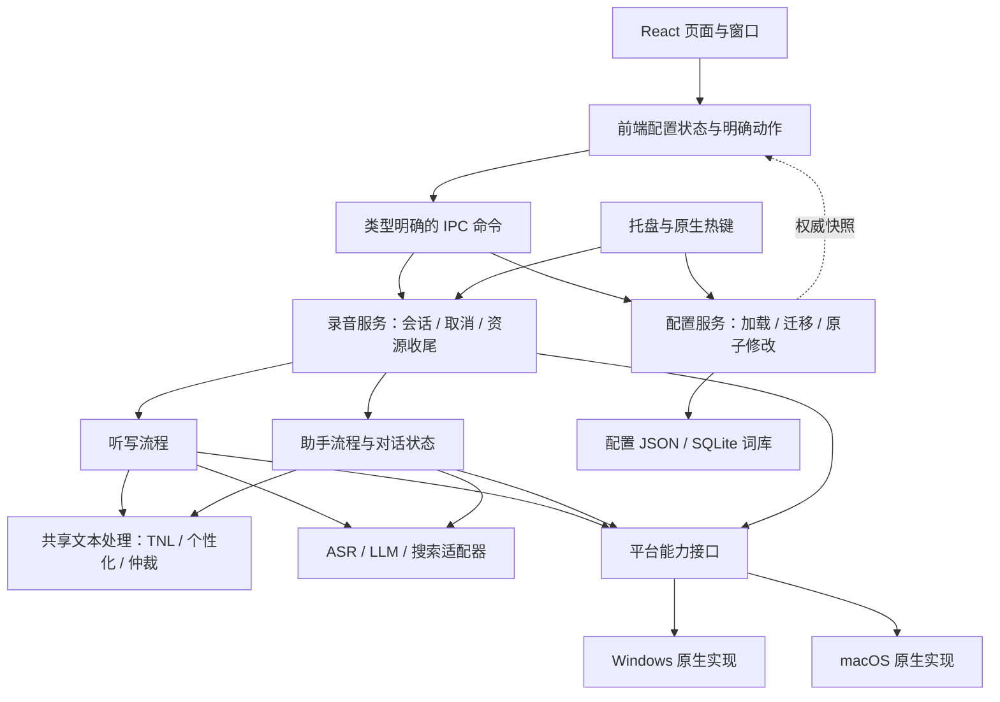

# 架构整顿：职责与实施顺序

兼容基线：线上最新正式版 **v1.6.1**，提交 `725aab0561f040f6e3203e73256b08a7a3d9ae43`（2026-09-28 确认）。保留用户凭据、选择、提示词、热键与词库；不要求用户重新配置。配置样本见 `tests/fixtures/config/`。

## 目标依赖方向

图表示本轮目标；完成状态以下表为准。保持单进程模块化，不引入远程服务或通用插件框架。

## 五步实施与验收

| 顺序 | 改动边界 | 必须具备的行为证据 | 状态 |
| --- | --- | --- | --- |
| 1 | 发布基线、升级与生命周期测试 | v1.6.1 四提供方加载/保存/重启、损坏文件保护；16 项热键行为及 4 项验收启动/取消用例通过。生产会话新增行为在第 3 步先写测试 | 基线完成 |
| 2 | 后端配置唯一修改入口 | 串行事务并发测试、局部修改与 null/省略区分、损坏文件保护；配置/词库服务已独立 | 已实施 |
| 3 | 录音会话与资源管理 | 单一会话拥有启动/处理/收尾；停止等待启动，取消丢弃迟到结果，收尾后才允许新录音；原生音频资源集中释放 | 已实施 |
| 4 | 听写/助手真实业务入口 | 实际助手/听写入口独立，共享规范化/个性化/仲裁/备用服务选择；删除未接入的旧助手管道；单轮配置快照 | 已实施 |
| 5 | 前端状态、保存动作和 IPC 类型 | 单一配置状态、局部写入队列、版本化快照；保存失败保留编辑并提供重试；真实页面验证而非源码正则断言 | 已实施 |

每步独立提交，在现有路径的行为测试通过后迁移；不把移动文件或测试数量当作完成标准。原生输入、剪贴板/焦点时序、厂商网络协议不在此次重写范围。真实 Windows 覆盖升级与桌面交互仍需独立验收，CI 编译打包不代替它们。

## 已落地模块

- `application/configuration.rs` + `config/repository.rs`：配置事务和词库投影。
- `application/recording.rs` + `recording_resources.rs`：单轮任务及原生资源生命周期。
- `application/assistant.rs`：真正的语音/文本助手、对话状态与结果动作。
- `application/transcription.rs`：ASR 收尾、备用提供方选择及听写入口。
- `pipeline/text.rs`：两种模式共用的文本规则与仲裁；`pipeline/normal.rs` 保留听写输出策略。
- `application/runtime.rs`：组合配置、录音和助手运行状态；`shell/windows.rs` 管理窗口展示。
- `src/state/configStore.ts`：权威快照与用户编辑分开管理，忽略旧版本通知，串行保存局部变化。
- `src/state/configActions.ts`：加载、启动修复、即时保存与显式词库导入；不在 React 渲染/通知期间迁移配置。
- `src/hooks/useAppConfig.ts`：React 订阅和字段编辑；`src/services/desktop.ts`：配置及服务生命周期的类型化 IPC 边界。

## 配置边界与回归方式

后端 `ConfigRepository` 串行执行加载、迁移、修改和原子保存；前端接收 `{ revision, config }`，只有用户编辑产生 patch。后台更新凭据或托盘设置不会被旧页面快照整体覆盖。数组（例如模型服务商列表）作为一个字段替换；不承诺同一数组的多个并行编辑可以自动合并。

主配置仍使用现有 JSON 文件和字段名称，SQLite 词库仍是权威来源。未指定的字段保留，显式 `null` 清空可选模型；未知 patch 字段报错，历史配置读取继续使用原有兼容处理。浏览器里的早期 ASR 缓存迁移和双帧定时抑制逻辑已退出主流程，v1.6.1 文件升级路径有固定样本覆盖。

运行 `npm run test:ts` 与 `cargo test --locked --manifest-path src-tauri/Cargo.toml` 做状态、事务和业务回归。首次执行浏览器验收前运行 `npx playwright install chromium`，再运行 `npm run test:ui`。浏览器测试启动真实 React 页面，以内存 IPC 代替原生后端，检查旧配置启动、不回写、模型/开关保存失败重试、凭据编辑及慢启动期间的输入保存；不使用用户配置或调用云端。这些测试已加入 Windows/macOS CI，不能代替原生麦克风、全局热键和安装覆盖升级验收。

本轮本地验证（2026-09-28）：Rust 全量测试 603 项通过（另有 7 项忽略），TypeScript 162 项通过，浏览器验收 5 项通过，前端构建、`cargo build --locked --features atdd` 与 macOS 原生键盘/剪贴板回归通过。Windows 的验证以集成分支 CI 和后续实机覆盖升级为准。

启动期间输入可以保留在编辑状态，但自动保存必须等待应用初始化完成，再将最新配置应用到服务。配置快照已经加载不代表服务初始化已经结束；两者分别跟踪，防止慢启动造成文件与运行状态不一致。
